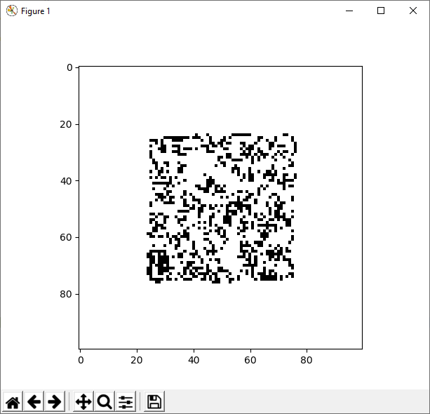

## Game of Life

### Abstract
Little python implementation of Conway's game of life.

[Conway's Game of Life on Wikipedia](https://en.wikipedia.org/wiki/Conway%27s_Game_of_Life)

The game board will be visualized with matplotlib.

### Example

### Description

#### Initialization

A gameboard with 100x100 cells will be created.
A quarter of the fields in the middle (50x50 cells) will be filled randomly with black squares. All other field will be filled with white squares.

#### Game Process

A black square means this cell is alive. A black square means this cell is dead.

The game runs in steps.
At each step each tile on the game board will be analyzed and updated with following rules:

* a dead cell with exactly three living neighbours will be reborn 
* a living cell with exactly two or three living neighbours keeps alive
* a living cell with less than two or more than three living neighbours dies

This implementation of the game has no real borders. A cell on the left border has its left neighbour on the right border. A cell on the top border has its upper neighbour on the bottom border. 